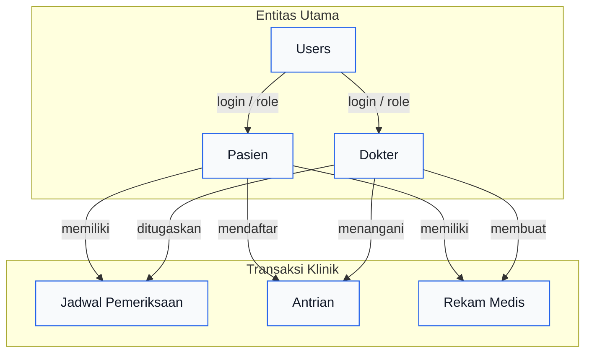

# ERD Project TUBES-UAS

Berikut ERD sistem klinik dalam format Mermaid.

## Keterangan singkat
- Pasien dapat memiliki banyak jadwal pemeriksaan, antrian, dan rekam medis.
- Dokter dapat memiliki banyak jadwal pemeriksaan, antrian, dan rekam medis.
- Tabel users digunakan untuk autentikasi dan role pengguna.
